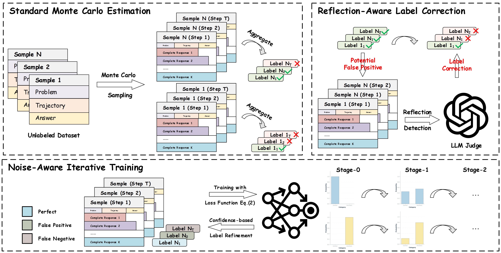

# NAIT

## Introduction
This repository shares the code and data of our latest work "Towards Robust Process Reward Modeling via Noise-aware Learning".




## Installation

To set up the project locally, please follow the instructions below:

1. Clone the repository:

   ```sh
   git clone https://github.com/xiebin23/NAIT.git
   cd NAIT
   ```

2. Create and activate a virtual environment:

   ```sh
   conda create -n nait python=3.10
   conda activate nait
   ```

3. Install the required dependencies:
   ```sh
   pip install transformers deepspeed openrlhf==0.9.1
   ```

## Example

After setting up the environment, you can run the experiments and analysis scripts as follows:

1. **Training:**

   - for generating soft label
     ```sh
     bash train/generate_soft_label.sh
     ```
   - for training process reward model
     ```sh
     bash train/train_prm_qwen.sh
     ```

2. **Evaluate:**

   - for Best-of-N Evaluation
     ```sh
     bash evaluate/generate_llm_responses_bon.sh
     bash evaluate/formatted_prm@n.sh
     bash evaluate/cal_prm@n_scores.sh
     bash evaluate/cal_prm@n_scores_stats.sh
     bash evaluate/run_check_prm@n.sh
     bash evaluate/run_eval_prm@n.sh
     ```
   - for Step-Level PRM Evaluation
     ```sh
     bash evaluate/run_eval_prm_rlhflow.sh
     ```
     
     

